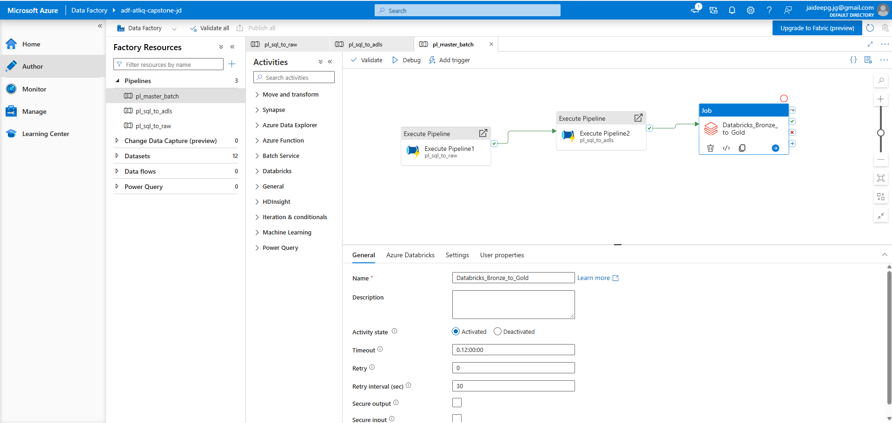
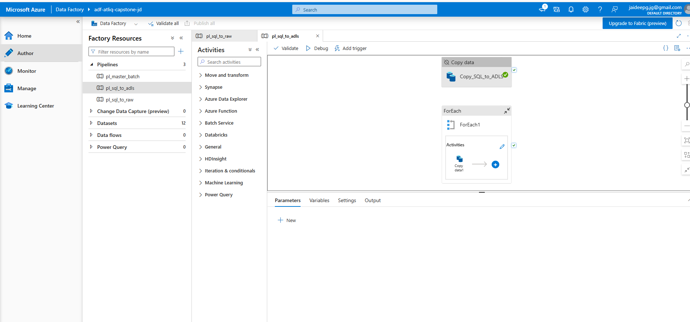
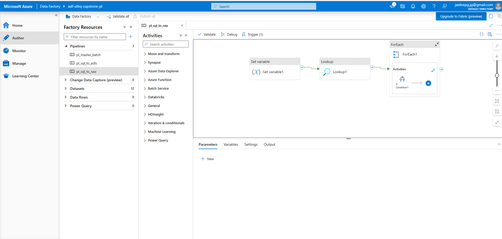
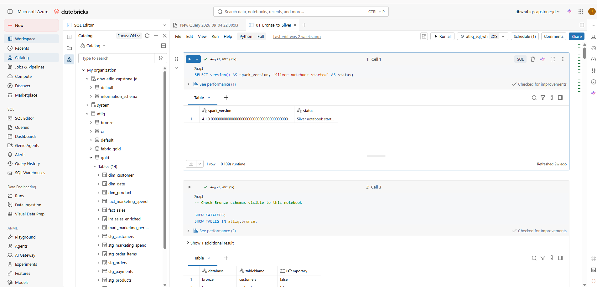
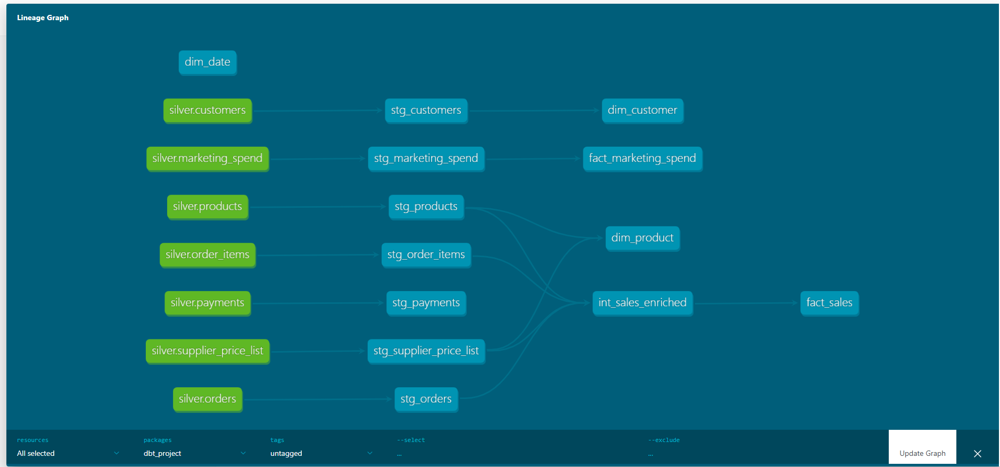
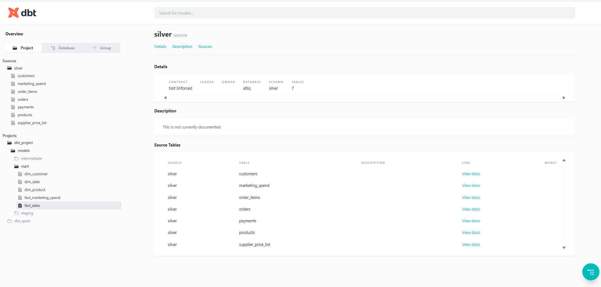
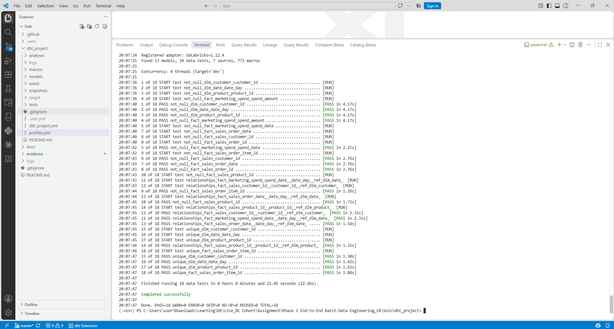
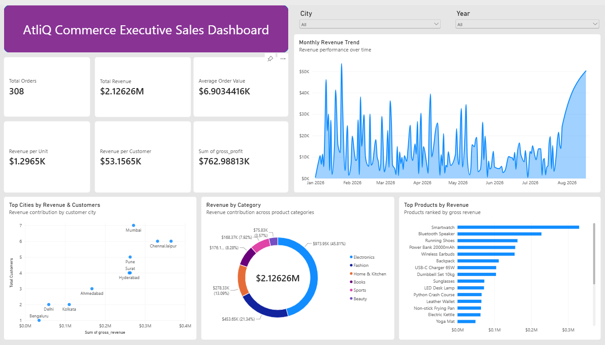

# AtliQ Commerce – End-to-End Batch Data Engineering

> **End-to-end batch data engineering project using Azure SQL, Azure Data Factory, ADLS Gen2, Azure Databricks, dbt Core, GitHub Actions and Microsoft Fabric.**

## Project Overview

This project builds an end-to-end analytical data platform for an e-commerce business.

The solution separates the operational OLTP workload from analytical processing and reporting:

```text
Azure SQL / CSV
      ↓
Azure Data Factory
      ↓
ADLS Gen2 – Bronze
      ↓
Azure Databricks – Silver
      ↓
dbt Core – Gold
      ↓
Microsoft Fabric / Power BI
```

The repository contains the implementation, transformation code, pipeline exports, dashboard artifacts, CI/CD configuration, project evidence and detailed technical documentation.

---

## Architecture


### Architecture Flow

| Layer | Technology | Responsibility |
|---|---|---|
| Source | Azure SQL | Operational OLTP data |
| Source | CSV | Marketing spend and supplier pricing |
| Ingestion | Azure Data Factory | Metadata-driven ingestion and orchestration |
| Storage | ADLS Gen2 | Durable Bronze/raw storage |
| Transformation | Azure Databricks | Bronze → Silver processing and enrichment |
| Analytical Modeling | dbt Core | Silver → Gold dimensional models and tests |
| Consumption | Microsoft Fabric / Power BI | Business analytics and dashboards |
| DevOps | GitHub + GitHub Actions | Version control and CI/CD |

---

## Business Problem

The operational database supports the e-commerce application, but leadership needs analytical answers such as:

- How is revenue changing over time?
- Which products generate the most revenue?
- Which cities contribute the most revenue?
- How can customer and sales performance be analyzed?
- How can supplier cost be used to understand profitability?

Running heavy analytical queries directly against the live OLTP database can affect application performance. Therefore, this project creates a separate analytical processing path and synchronizes the data through a nightly batch.

---

## Source Data

### Azure SQL – OLTP

The operational database contains:

- `customers`
- `products`
- `orders`
- `order_items`
- `payments`

### Marketing Spend

`marketing_spend.csv`

```text
spend_date
channel
campaign
spend_amount
clicks
```

### Supplier Price List

`supplier_price_list.csv`

```text
product_id
product_name
supplier_name
supplier_cost
effective_date
```

The supplier price list is used to enrich product/sales data for cost and profitability analysis.

Marketing spend is modeled separately from sales because the available source data does not contain a reliable sale-to-campaign attribution key. A date-only join could multiply sales when several campaigns/channels exist on the same date.

---

# Data Engineering Architecture

## 1. OLTP – Azure SQL

Azure SQL acts as the operational source system.

The normalized OLTP model is designed for transactional workloads, with separate tables for customers, products, orders, order items and payments.

The project also uses an ETL control table and watermark concepts for incremental ingestion.

---

## 2. Ingestion – Azure Data Factory

Azure Data Factory handles source extraction and orchestration.

Main pipelines:

### `pl_sql_to_raw`

SQL extraction and raw ingestion flow.

### `pl_sql_to_adls`

Landing/orchestration flow for ADLS-oriented Bronze storage.

### `pl_master_batch`

Master pipeline coordinating the end-to-end batch process.

High-level orchestration:

```text
pl_sql_to_raw
      ↓
pl_sql_to_adls
      ↓
Databricks_Bronze_to_Gold
```

Pipeline JSON exports and implementation screenshots are available in:

`evidence/M2_ADF/`

---

## 3. Bronze – ADLS Gen2 / Databricks

Bronze is the source-oriented landing layer.

Its purpose is to:

- Preserve ingested source data.
- Separate ingestion from transformation.
- Provide durable cloud storage.
- Provide a repeatable input for downstream processing.

The SQL-derived Bronze data is stored as Parquet.

---

## 4. Silver – Azure Databricks

Azure Databricks performs the main distributed transformation and enrichment work.

The Silver layer is responsible for:

- Cleaning and standardizing source data.
- Applying appropriate data types.
- Transforming source structures.
- Enriching sales with product information.
- Enriching sales with supplier cost.
- Applying incremental MERGE/upsert logic where appropriate.

Databricks implementation evidence is available in:

`evidence/M3_SILVER/`

---

# Gold Layer – dbt

The analytical Gold layer is managed with dbt Core.

Unity Catalog:

```text
atliq
```

Relevant schemas include:

```text
atliq.bronze
atliq.silver
atliq.gold
atliq.ci
```

## Gold Model

The central sales fact uses the grain:

> **One row per order item**

### Dimensions

- `dim_customer`
- `dim_product`
- `dim_date`

### Facts

- `fact_sales`
- `fact_marketing_spend`

### Intermediate

- `int_sales_enriched`

### Staging

- `stg_customers`
- `stg_marketing_spend`
- `stg_order_items`
- `stg_orders`
- `stg_payments`
- `stg_products`
- `stg_supplier_price_list`

The current dbt implementation materializes staging and intermediate models as views in the `atliq.gold` schema, while the analytical marts are materialized as tables.

---

## dbt Validation

The project currently contains:

- **13 dbt models**
- **18 data tests**
- **7 sources**

Validation results:

```text
dbt run
13 / 13 models passed

dbt test
18 / 18 tests passed
0 warnings
0 errors
0 skipped tests
```

Tests include:

- Not-null checks
- Uniqueness checks
- Relationship checks

dbt evidence is available in:

`evidence/M4_GOLD_DBT/`

---

# Data Quality & Reconciliation

Key validation performed during the implementation:

| Check | Result |
|---|---:|
| Customer duplicate check | 0 |
| Product duplicate check | 0 |
| Fact order-item uniqueness | 0 |
| Date referential integrity | 0 orphan rows |
| Supplier cost completeness | 798 / 798 |
| Gross revenue | 2,126,260.00 |
| Supplier cost (`quantity × unit cost`) | 1,363,271.87 |
| Gross profit | 762,988.13 |
| Profit reconciliation difference | 0.00 |

These checks validate both structural integrity and the financial calculations used by the analytical model.

---

# Nightly Batch & Reliability

The solution is designed as a nightly batch process.

```text
Azure SQL / CSV
      ↓
ADF ingestion
      ↓
ADLS Bronze
      ↓
Databricks Bronze → Silver
      ↓
dbt Gold
      ↓
Fabric reporting
```

The scheduled processing is designed around retry-safe behavior:

- Same-day Bronze data can be overwritten on retry.
- Silver fact processing uses MERGE/business-key logic.
- Gold models are rebuilt from curated upstream data.

The project also includes nightly execution evidence in:

`evidence/M5_NIGHTLY_SYNC/`

## Idempotency Proof

The complete `pl_master_batch` pipeline was executed twice against the same source state.

The results below were captured from `atliq.gold.fact_sales` after each full pipeline execution:

| Metric | Run 1 | Run 2 | Result |
|---|---:|---:|---|
| `fact_sales` row count | 798 | 798 | ✅ Match |
| Total `gross_revenue` | 2,126,260.00 | 2,126,260.00 | ✅ Match |
| Total supplier cost of sold units (`quantity × supplier_cost`) | 1,363,271.87 | 1,363,271.87 | ✅ Match |

### Result

The complete end-to-end pipeline produced identical analytical results on both executions.

This demonstrates that rerunning the same batch does **not create duplicate sales records or change the calculated financial totals**, providing evidence of idempotent/retry-safe processing.

Supporting screenshots are stored in:

`evidence/M5_NIGHTLY_SYNC/`

# Microsoft Fabric / Power BI

## Executive Dashboard

**AtliQ Commerce Executive Sales & Performance Dashboard**

The dashboard includes executive KPIs and analytical views including:

- Revenue trend
- Top products by revenue
- Top cities by revenue
- Revenue by category

Dashboard artifacts and evidence are available in:

`evidence/M6_FABRIC/`

Files include the editable Power BI/Fabric report artifact, PDF export, dashboard screenshot and data-model screenshot.

---

# CI/CD – GitHub Actions

The dbt project is integrated with GitHub Actions.

Workflow:

`.github/workflows/ci.yml`

The CI process:

1. Checks out the repository.
2. Installs the required dbt tooling.
3. Uses Databricks connection values supplied through GitHub Secrets.
4. Runs the dbt CI build.
5. Uses dbt tests as data-quality gates.

Secrets are not hard-coded in the repository.

CI/CD evidence is available in:

`evidence/M7_CICD/`

---

# Evidence Gallery

The repository contains implementation screenshots and artifacts for each milestone.

## M2 – Azure Data Factory

### Master Pipeline



### SQL → ADLS



### SQL → Raw



[Open all M2 ADF evidence](evidence/M2_ADF/)

---

## M3 – Databricks Silver

### Bronze → Silver Transformation



[Open all M3 Silver evidence](evidence/M3_SILVER/)

---

## M4 – dbt Gold

### dbt DAG / Lineage



### dbt Sources



### dbt Tests



[Open all M4 Gold/dbt evidence](evidence/M4_GOLD_DBT/)

---

## M5 – Nightly Execution

### Nightly Run


[Open all M5 evidence](evidence/M5_NIGHTLY_SYNC/)

---

## M6 – Microsoft Fabric

### Executive Dashboard



### Data Model


[Open all M6 Fabric evidence](evidence/M6_FABRIC/)

---

## M7 – CI/CD

GitHub Actions screenshots and supporting evidence are available in:

`evidence/M7_CICD/`

[Open all M7 CI/CD evidence](evidence/M7_CICD/)

---

# Repository Structure

```text
.
├── .github/
│   └── workflows/
│       └── ci.yml
│
├── dbt_project/
│   ├── models/
│   ├── tests/
│   ├── macros/
│   ├── analyses/
│   ├── dbt_project.yml
│   └── profiles.yml
│
├── evidence/
│   ├── M1_OLTP/
│   ├── M2_ADF/
│   ├── M3_SILVER/
│   ├── M4_GOLD_DBT/
│   ├── M5_NIGHTLY_SYNC/
│   ├── M6_FABRIC/
│   └── M7_CICD/
│
├── atliq_commerce_architecture.svg
├── Cdebasics_AtliQ_End_to_End_Data_Engineering_Project_Report.pdf
├── Cdebasics_AtliQ_End_to_End_Data_Engineering_Project_Report.docx
├── .gitignore
└── README.md
```

---

# Key Engineering Decisions

### Why separate OLTP and analytics?

The operational database is optimized for transactions, while the downstream analytical platform is optimized for reporting and aggregation. This protects the application workload from heavy analytical queries.

### Why ADLS Gen2?

ADLS provides durable cloud storage independently of compute. Data can remain available even when Databricks compute is stopped.

### Why Databricks?

Databricks provides scalable distributed processing for Bronze/Silver transformation, enrichment and incremental workloads.

### Why dbt?

dbt provides SQL-based analytical modeling, dependency management, testing and documentation.

### Why ADF?

ADF provides managed ingestion and orchestration between the operational source, storage and transformation workloads.

### Why GitHub Actions?

GitHub Actions provides automated CI validation so dbt changes can be tested consistently.

### Why not directly join sales and marketing by date?

Because several campaigns or channels may exist on the same date. Without a sale-to-campaign attribution key, a direct join can duplicate sales and produce incorrect metrics.

---

# Issues Faced & Resolutions

### PowerShell execution policy

Local dbt activation/scripts were initially blocked.

**Resolution:** Used a process-scoped PowerShell execution-policy change.

### dbt–Databricks connection

The initial dbt connection required correction of the environment variables and Databricks host configuration.

**Resolution:** Configured the connection through environment variables and validated it with `dbt debug`.

### Credential security

A Databricks token was accidentally exposed during troubleshooting.

**Resolution:** The credential was replaced. The repository uses environment variables and GitHub Secrets rather than storing the actual credential.

### GitHub Actions authentication

CI initially failed because the Databricks authentication secret was stale.

**Resolution:** The GitHub secret was updated and the CI workflow subsequently passed.

### Catalog naming

The Unity Catalog used by the project is:

```text
atliq
```

Consistent catalog naming avoids object-not-found errors.

---

# Security

Never commit:

- Databricks tokens
- Passwords
- `.env` files containing secrets
- Connection strings containing credentials

Use environment variables, GitHub Secrets or an appropriate secret-management service.

---

# Local dbt Commands

From the dbt project directory:

```powershell
cd dbt_project
dbt debug
dbt run
dbt test
dbt build
```

Connection credentials should be supplied securely through environment variables.

---

# Project Documentation

## Detailed Project Report

The repository contains both PDF and Word versions of the detailed project documentation.

- 📄 **[View Project Report (PDF)](Cdebasics_AtliQ_End_to_End_Data_Engineering_Project_Report.pdf)**
- 📝 **[Download Project Report (DOCX)](Cdebasics_AtliQ_End_to_End_Data_Engineering_Project_Report.docx)**

The report documents the implementation, architecture, design decisions, validation, troubleshooting and learning outcomes.

# Project Outcome

This project demonstrates an end-to-end batch data engineering workflow covering:

- OLTP data modeling
- Incremental ingestion
- ADLS Gen2 data lake storage
- Bronze / Silver / Gold architecture
- Azure Databricks transformation
- Unity Catalog
- Dimensional modeling
- dbt transformation and testing
- Data-quality validation
- Nightly orchestration
- Retry/idempotency-oriented processing
- Microsoft Fabric analytics
- Git version control
- GitHub Actions CI/CD
- Technical documentation
- Implementation evidence

---

# Author

**Jaideep Gupta**

Data Engineering / Analytics Engineering Portfolio Project

**Technologies:** Azure SQL • Azure Data Factory • ADLS Gen2 • Databricks • Unity Catalog • dbt • Microsoft Fabric • Power BI • GitHub Actions
